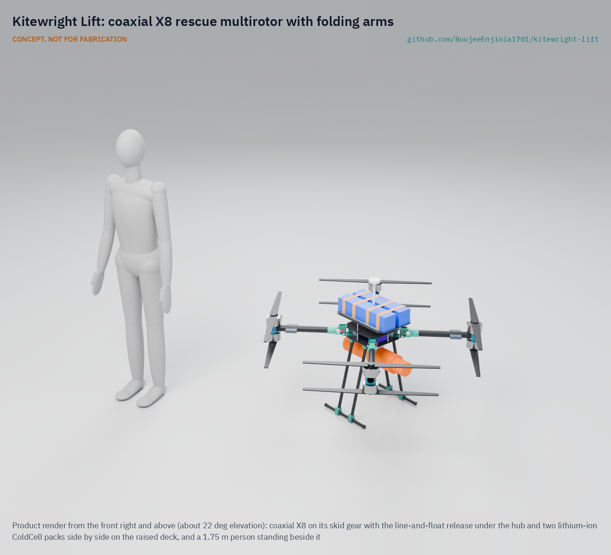
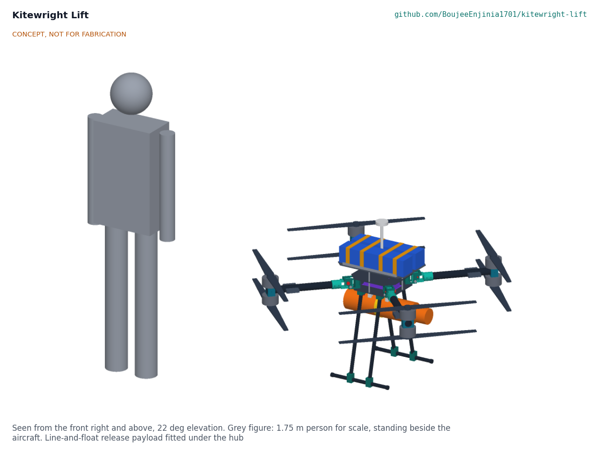
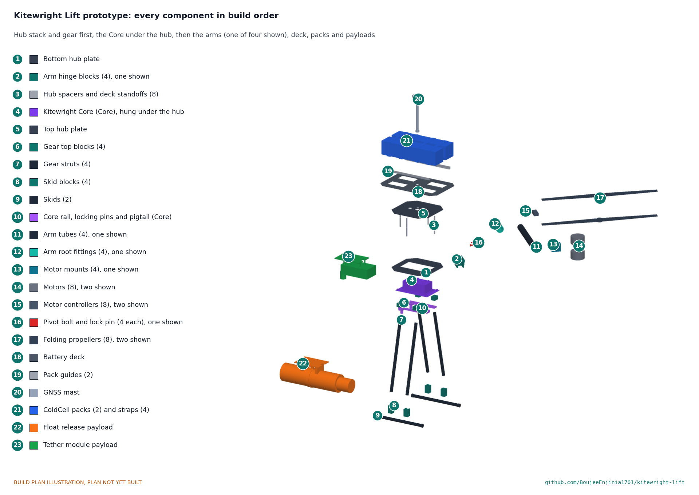

# Kitewright Lift

   

**Area:** Aerial robotics · **TRL:** 3 of 9 (proof of concept on paper; design constructable) · **Value-engineering target:** USD 5,000; estimated cost of the constructable design USD 6,627 (USD 1,627 over the target) · **Difficulty:** 4 of 5

[Design precis](docs/02-concept.md) · [Requirements](docs/03-requirements.md) · [Calculations](docs/04-calcs/01-sizing.md) · [Prototype build plan](docs/05-build-plan.md) · [Design decisions](docs/06-design-decisions.md) · [General arrangement](cad/drawings/KWL-DWG-001.pdf) · [3D viewer](media/viewer.html)

A multirotor frame for the Kitewright family that hovers, lifts, winches and flies on a tether in disasters and remote terrain.

## Concept rationale

Kitewright Lift is the utility multirotor of the Kitewright family. It is a frame, motors and propellers built around the shared Kitewright Core, so the autopilot, ColdCell power bus and payload mount are the same as on every other Kitewright aircraft. What Lift adds is lift: enough thrust margin to hover with a few kilograms at altitude, a clear space under the body for payloads, and a power input for a ground tether. The same frame can search, drop a line or float, lower a small load, or stay up for hours as a lookout or radio relay over a disaster site.

The frame is sized for thin air from the start, because the family's first target is the high mountains of Kashmir and the Himalaya. Our first estimate is that at 5,000 m and -20 °C hover time falls to about 47% of sea level (estimate), so propeller and motor choices come from AltiRig bench data rather than sea-level catalogues. Keeping the take-off mass at or under 25 kg keeps Lift in the small drone classes used by the FAA and by India's Drone Rules 2021.

## Burning platform

Floods and landslides regularly cut people off. The 2022 Pakistan floods affected 33 million people ([UN News, 2022](https://news.un.org/en/story/2022/08/1125752)); the 2024 eastern Bangladesh floods affected 5.6 million, with more than 500,000 seeking shelter ([UNICEF, 2024](https://www.unicef.org/press-releases/two-million-children-risk-worst-floods-three-decades-lash-through-eastern-bangladesh)). The October 2023 South Lhonak glacial lake outburst in Sikkim left at least 35 dead and about 104 missing, destroyed 13 bridges and affected more than 60,000 people ([Mongabay India, 2023](http://india.mongabay.com/2023/10/no-early-warning-system-and-insufficient-dam-safety-turned-sikkim-flood-deadly/)). In events like these, drones already help: DJI counts more than 1,000 people rescued with drone help worldwide ([DJI, 2023](https://www.dji.com/media-center/announcements/dji-records-more-than-1000-people-rescued-by-drones-globally)).

Heavy-lift capability exists, but closed and costly. The DJI FlyCart 30 carries 30 kg with two batteries, has a winch mode for places it cannot land and a 6,000 m service ceiling ([Wikipedia, DJI FlyCart](https://en.wikipedia.org/wiki/DJI_FlyCart)); on Everest it carried 15 kg between 5,300 and 6,000 m ([DJI, 2024](https://www.dji.com/media-center/announcements/dji-completes-world-first-drone-delivery-tests-on-mount-everest-en)). The smaller DJI Matrice 350 RTK costs USD 14,814 for a 960 g payload ([Advexure](https://advexure.com/products/dji-matrice-350-rtk)). There is no open multirotor frame, documented for altitude and cold, that rescue groups can build, repair and fit with their own payloads.

## Where it could be used

### By industry

| Industry | Use |
| --- | --- |
| Flood and disaster response | Hover over stranded people, drop a float or line, and relay radio from a tether |
| Mountain rescue | Search with AvalancheScout and thermal payloads; lower small items to a casualty |
| Glacial hazard monitoring | Short-range lake and moraine survey with LakeWatch where Range cannot land |
| Remote health and logistics | Carrying light medical supplies across cut roads and rivers |
| Infrastructure inspection | Bridges, dams and hydropower intakes in steep valleys |
| Research and education | An open multirotor test bed for payload and high-altitude flight work |

### By country or region

| Country or region | Why it matters there |
| --- | --- |
| India (Sikkim and the Himalaya) | The 2023 South Lhonak outburst destroyed 13 bridges and affected more than 60,000 people ([Mongabay India, 2023](http://india.mongabay.com/2023/10/no-early-warning-system-and-insufficient-dam-safety-turned-sikkim-flood-deadly/)); a Lift at or under 25 kg sits in the Small class of India's Drone Rules 2021 ([PIB](https://static.pib.gov.in/writereaddata/specificdocs/documents/2022/jan/doc202212810701.pdf)). |
| Pakistan | The 2022 floods affected 33 million people and damaged about 3,500 km of roads and 150 bridges ([UN News, 2022](https://news.un.org/en/story/2022/08/1125752)); in the Karakoram a drone found Rick Allen alive on Broad Peak ([Explorersweb, 2018](https://explorersweb.com/rick-allen-found-alive-on-broad-peak/)). |
| Bangladesh | The 2024 eastern floods affected 5.6 million people with more than 500,000 in shelters ([UNICEF, 2024](https://www.unicef.org/press-releases/two-million-children-risk-worst-floods-three-decades-lash-through-eastern-bangladesh)). |
| Nepal | Drone delivery on Everest replaced 6 to 8 hour icefall carries with a 12 minute round trip in 2024 tests ([DJI, 2024](https://www.dji.com/media-center/announcements/dji-completes-world-first-drone-delivery-tests-on-mount-everest-en)). |
| United States | Part 107 covers drones under 55 lb (25 kg) and allows securely attached external loads ([FAA](https://www.faa.gov/uas/media/Part_107_Summary.pdf)), which is the class Lift targets. |

## What sparked the idea

In July 2018 the climber Rick Allen went missing high on Broad Peak in the Karakoram after a fall while descending. After 36 hours, Bartek Bargiel, who was filming a ski descent of K2, flew a small drone over the slope, spotted Allen alive at about 7,500 m and guided climbers to him ([Explorersweb, 2018](https://explorersweb.com/rick-allen-found-alive-on-broad-peak/)). The drone was a DJI Mavic Pro, flown far above its rated ceiling ([DroneDJ, 2018](https://dronedj.com/2018/07/16/mountaineer-rick-allen-was-feared-dead-on-broad-peak-but-a-dji-mavic-pro-drone-found-him-alive/)). Kitewright Lift is the frame that could follow such a find: hover over the spot, lower a line or supplies, and stay overhead while the rescuers climb.

## Problem

After floods, landslides and mountain accidents, rescuers need a drone that can hover over one spot, carry a few kilograms, lower a line or a float, and stay up for hours on a tether. Drones that do this are closed and cost many times what local teams can spend.

Full problem statement: [docs/01-problem.md](docs/01-problem.md)

## Concept

A coaxial X8 for the Kitewright family: four carbon arms that fold down on machined hinges, a motor above and below each arm tip with 30 inch propellers, the Kitewright Core hung under a two-plate carbon hub to the family envelope, two ColdCell packs on a raised deck above, and payloads on the Core's rail below. Lift holds each arm up against a fixed stop in flight, so a missed lock pin cannot let an arm fold. Two payloads are designed with it: a line-and-float release and a 400 V tether module for hours of hover.

Full design precis: [docs/02-concept.md](docs/02-concept.md) · Requirements: [docs/03-requirements.md](docs/03-requirements.md)

## Key numbers (KWL-CAL-001, estimates)

| Quantity | Value |
| --- | --- |
| Take-off mass | 21.8 kg ready to fly; 25.0 kg with the rated 3.2 kg payload |
| Thrust to weight | 2.88 at sea level; 1.84 at 5,000 m and -20 °C with 2 kg; 1.43 there with a motor out |
| Hover time (two ColdCell lithium-ion packs, 1,361 Wh) | 20.4 min at sea level with the rated payload; 14.5 min at 5,000 m with 2 kg |
| Tethered hover | 3.6 kW from a 400 V ground supply over 60 m of tether |
| Folded | 0.88 x 0.48 x 0.45 m, gear on |

No decisions are open: R4's sea-level case now reads "with the rated payload" (2026-10-04); see the [design decisions register](docs/06-design-decisions.md).

## Key components

- Carbon hub plates and battery deck
- Machined arm hinges with stop bridge, pivot bolt and lock pin
- Carbon arm tubes, root fittings and coaxial motor clamps
- Eight motors, controllers and 30 inch folding propellers
- Kitewright Core, hung under the hub to the family envelope
- Two ColdCell packs
- Skid landing gear
- Line-and-float release payload
- Tether module and ground set
- Winch module (not designed until its patent screen)

## Building the prototype

The [prototype build plan](docs/05-build-plan.md) (KWL-BLD-001) takes a capable maker through every component in build order, with a making sketch for each made part, close-ups of the joints and a picture for every assembly step. The carbon plates are CNC routed, the carbon tubes cut and drilled, and the aluminium hinge, arm and gear fittings machined; the Core and packs are built to their own designs. The hinges are proof-loaded before first flight, and the plan's safety stops cover first power, first flight, the tether and payload drops. It is a plan, not yet built.

## Safety

> Published as an open engineering reference, not certified aviation equipment.
>
> Civilian use only. No weapons, targeting or military payloads, and none will be accepted into the family.
>
> Certification and operating approvals (FAA Part 107 in the United States, EASA rules in Europe, India's DGCA Drone Rules 2021) are out of scope at this TRL and will be addressed if prototypes progress. Builders must fly only where local rules allow.
>
> Propellers can cause serious injury: arm only with every arm lock pin in and flagged and nobody within 15 m, and write pre-flight, arming and keep-out procedures before any powered test. Every arm hinge is proof-loaded before first flight.
>
> The tether carries 400 V DC: isolated, monitored ground supply with an emergency stop; nobody handles a live tether.
>
> Lithium battery packs can catch fire after a crash, over-charge or cold charging; follow ColdCell safety rules.
>
> Never carry or lift people. Suspended loads and lines must have a release that the pilot can operate at any time, and nobody stands under a suspended load. The float's line is never tied to the aircraft; drops are made from 10 m or higher.
>
> A tether can snag or conduct: route it clear of people, power lines and water currents, and fit a breakaway at the aircraft.
>
> Downwash near people in water, on snow slopes or on rooftops can knock them over or trigger slides; keep a minimum hover height set by test.
>
> Loss of link or thrust in thin air can mean a crash in remote terrain; failsafes must be set and tested at each altitude band.
>
> This design is published as an open engineering reference. It is not certified equipment. CONCEPT, NOT FOR FABRICATION.

## Repository layout

| Folder | Contents |
| --- | --- |
| `docs/` | Problem, concept, requirements, calculations and design decisions |
| `cad/src/` | build123d Python source, the source of truth for all geometry |
| `cad/step/`, `cad/stl/` | Exported models for FreeCAD, other CAD tools and printing |
| `cad/drawings/` | 2D sketches and dimensioned drawings |
| `bom/` | Bill of materials |
| `electronics/` | KiCad schematics and PCB layouts |
| `firmware/` | Microcontroller code |
| `media/` | Renders, perspectives and photos |
| `build-log/` | Dated prototyping notes |

## Documentation

Controlled documents follow the portfolio [documentation standard](.kit/STANDARDS.md). Each carries a document ID (KWL-PRC-001 for the precis), a version and a revision history. Branded PDFs are built with `python .kit/render.py` and attached to GitHub Releases when a document is tagged, for example `KWL-PRC-001/v1.0`.

## Credits

Designed by Amish Chadha at Design Molecule Labs. See [CONTRIBUTORS.md](CONTRIBUTORS.md) for roles. To cite this design, use [CITATION.cff](CITATION.cff) (GitHub shows it as "Cite this repository").

AI assistance (Claude) was used to accelerate prototype documentation and first-pass research. Design direction and all decisions are Amish Chadha's, recorded in this repository's decision records (`docs/decisions/`).

## Licenses

- **Hardware** (CAD, drawings, BOM, electronics): [CERN-OHL-S v2](LICENSE)
- **Software** (firmware, scripts, notebooks): [MIT](LICENSE-SOFTWARE)

A project of the [Design Molecule](https://designmolecule.com) lab.
