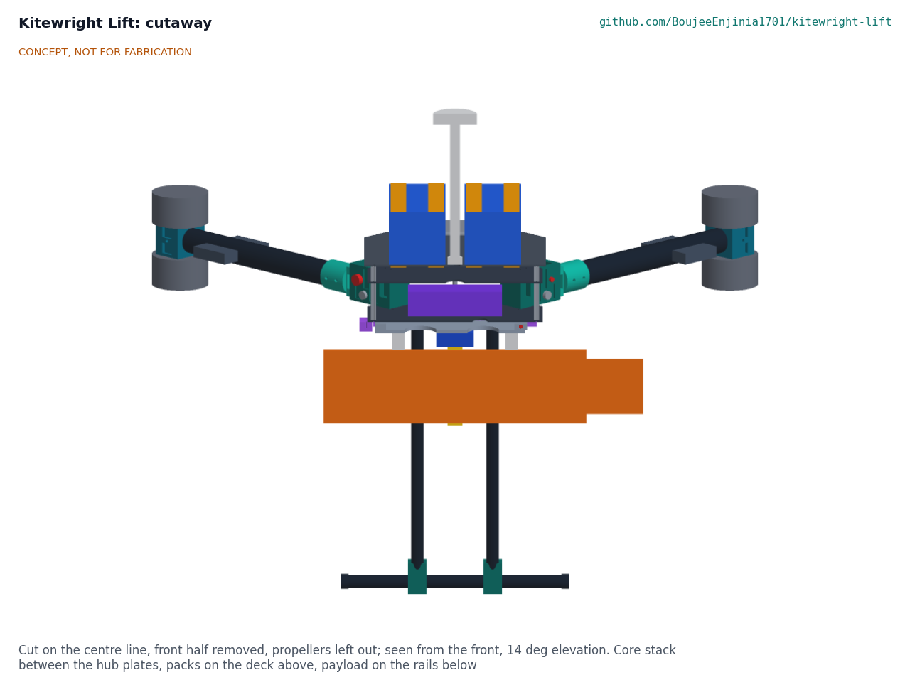
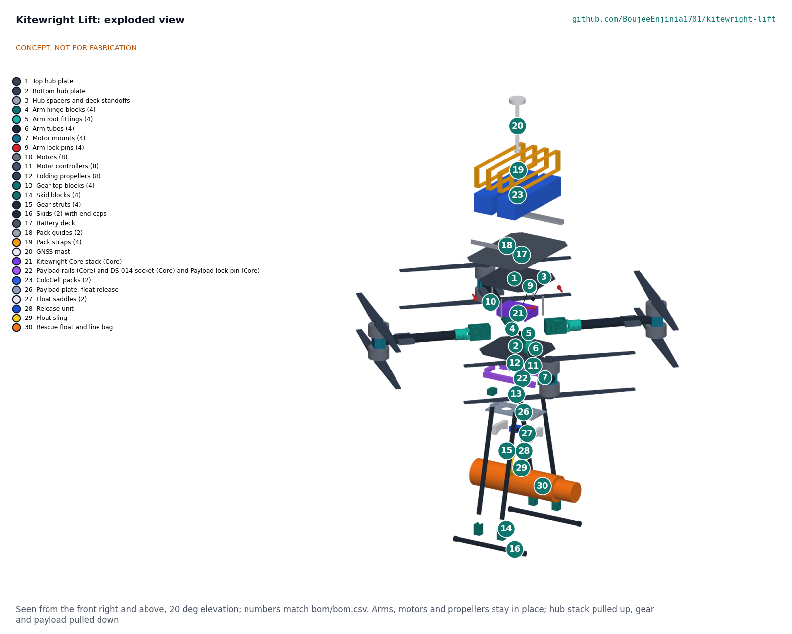
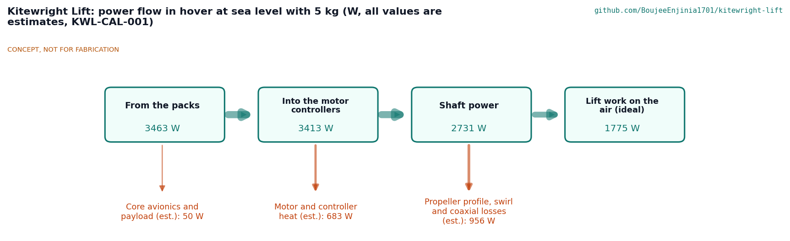

# Kitewright Lift design precis

A multirotor frame for the Kitewright family that hovers, lifts, winches and flies on a tether in disasters and remote terrain.

*Figure 1. Kitewright Lift, flying-ready with the line-and-float release under the hub. CONCEPT, NOT FOR FABRICATION.*

## How it works

Kitewright Lift is a coaxial X8: four carbon arms on a two-plate carbon hub, each arm carrying one motor on top of its tip and one underneath, with 30 inch folding propellers turning opposite ways. If any one motor stops, its partner on the same arm keeps that corner flying, and the autopilot shares the load among the other arms, so the aircraft can still hover and land.

Each arm hinges on a machined aluminium block at a hub corner and folds down for transport. In flight the lift on the arm presses the arm's root fitting up against a stop bridge on the hinge block, so the arm cannot fold under power even if its lock pin were left out; the ball-lock pin only stops the arm drooping on the ground. Folded, with the propeller blades turned back along the arms, the aircraft measures about 0.84 x 0.48 x 0.45 m and fits the 1.2 x 0.6 x 0.5 m case of R9 with its landing gear on.

The Kitewright Core stack (autopilot, radios, power bus) sits between the hub plates on rubber dampers. Two ColdCell packs sit on a carbon deck above, held by guides and cam straps, with the GNSS mast between them. Under the hub, the Core payload mount takes any payload on a standard plate: the plate slides into two slotted rails until its plug seats in the DS-014 socket, and a ball-lock pin passes through both rails and the plate's lug. Two payloads are designed here: the line-and-float release, which drops a foam float with 30 m of floating line to a person in water, and the tether module, which turns 400 V DC from a ground supply into the 51 V bus for hours of hover as a lookout or radio relay.

*Figure 2. Cutaway on the centre line: Core stack between the hub plates, packs on the deck above, the payload on the rails below.*

## Components

| # | Component | Role |
| --- | --- | --- |
| 1 | Hub plates and spacers | Two 3 mm carbon plates 280 mm square, 60 mm apart, on the four hinge blocks and four spacers |
| 2 | Arm hinges | Machined clevis blocks with stop bridge, 8 mm pivot bolt and ball-lock pin; arms fold down |
| 3 | Arms | 40 mm carbon tubes bonded and bolted into aluminium root fittings and motor clamps |
| 4 | Motors, controllers and propellers | Eight motors of the 10 kg static thrust class, 80 A controllers on the arms, 30 x 10 folding propellers |
| 5 | Kitewright Core stack | Autopilot, GNSS, radios and the ColdCell power bus with a tether input, unchanged from the Core design |
| 6 | Battery deck and ColdCell packs | Two ColdCell lithium-ion 14S3P heated packs (680 Wh each) on a 290 x 430 mm carbon deck above the hub; the harness carries the Core's pack and frame leads |
| 7 | Payload mount | The Core's slotted rails, payload pin and DS-014 socket under the bottom plate |
| 8 | Line-and-float release | Fail-closed servo pin release, webbing sling, foam float with 30 m of line |
| 9 | Tether module and ground set | 4 kW onboard converter and breakaway; 400 V ground supply, 60 m tether, reel, insulation monitor and emergency stop |
| 10 | Landing gear | Four carbon struts and two skids, 450 mm apart, in machined blocks |
| 11 | Winch module | Not designed until its patent screen is done; the payload bay leaves room for it |

*Figure 3. Exploded view; numbers match `bom/bom.csv`.*

## Key design choices

All decided on 2026-10-03 under Amish's pre-approvals (KWL-DDR-001 and KWL-DDR-002):

- **Coaxial X8** rather than a flat hexa- or octocopter, for motor-out tolerance and a compact fold.
- **Arms fold down against a stop.** Lift holds each arm against a fixed bridge; the lock pin never carries flight loads.
- **Controllers on the arms**, so only two power leads per arm cross the hinge.
- **Fixed skid gear** that stays on when folded; the folded motors clear the skids and the ground.
- **One payload plate** for every payload, on the Core's rails, pin and socket.
- **Fixed-voltage tether** (400 V DC) with an isolated onboard converter and a breakaway, clear of adaptive-voltage tether patents.
- **No winch** until its patent screen is done.

## First-order numbers

From KWL-CAL-001 (`docs/04-calcs/sizing.py`). All are estimates; nothing has been measured.

*Table 1. First-order numbers.*

| Quantity | Value | Assumptions |
| --- | --- | --- |
| Motor spacing; propellers | 1,240 mm diagonal; 30 inch, 115 mm tip gap, 170 mm coaxial gap | `cad/src/model.py` |
| Empty mass (no packs, no payload) | 13.6 kg | Made parts 5.86 kg from the model, pocketed fittings; motors 450 g, controllers 110 g, propellers 110 g, Core 1.0 kg, wiring with the Core leads 0.77 kg |
| Two ColdCell packs | 7.7 kg, 1,361 Wh | Lithium-ion 14S3P of 21700 cells, 3.84 kg and 680 Wh each (ColdCell CCL-CAL-001 K) |
| Take-off mass with 5 kg | 26.3 kg (R1 not met) | 21.3 kg ready to fly |
| Hover power, sea level, 5 kg | 3.5 kW | Coaxial factor 1.28, figure of merit 0.65, drive efficiency 0.80, 50 W avionics and payload |
| Hover time, sea level, 5 kg | 18.9 min | 80 % of pack energy used |
| Hover time, 5,000 m and -20 C, 2 kg | 15.0 min | Air density 0.743 kg/m3; ColdCell delivers 85 % in the cold |
| Thrust to weight | 2.74 at sea level; 1.87 at 5,000 m | 10 kg per motor at full throttle, lower rotor 80 % |
| One motor out | 2.13 at sea level; 1.46 at 5,000 m | Partner motor alone on the failed arm |
| Arm load at full thrust | 177 N; 2.6 kN on the stop bridge | 30 mm from pivot to bridge |
| Tethered hover | 3.1 kW on the bus; 3.5 kW from the ground; 25 V drop and 215 W lost in the tether | 400 V, 60 m, 2 x 0.75 mm2, 95 % converter |
| Float drop | Expected miss 2.2 m from 10 m in 10 m/s wind | 2 m position hold; drift aimed off to 30 % |
| Folded size | 0.84 x 0.48 x 0.45 m | From the folded model |
| Estimated cost | USD 6,418 for the aircraft; USD 3,716 for the payloads and ground set | `bom/bom.csv`, indicative prices |

Value-engineering target: USD 5,000. Estimated cost of the constructable design: USD 6,418 (USD 1,418 over the target).

*Figure 4. Where the power goes in hover at sea level with 5 kg (estimates).*

## Patent design-arounds

From the preliminary patent, trademark and prior-art screen (not legal advice):

- Generic multirotor frame; no specific frame patents identified in the preliminary screen. The coaxial X8 layout and a clevis fold hinge are long-established.
- Winch not yet screened: no winch design is published until a patent screen is done.
- Tether power is a fixed-voltage supply with onboard DC-DC, not adaptive tether voltage (Elistair US11059580B2, to 2037).
- Payload mount and power bus follow the Kitewright Core design-arounds (DS-014 connector with plain rail and locking pin; external-heater ColdCell packs).

## Shared blocks

- Kitewright Core (autopilot, radios, payload mount, power bus with tether input)
- ColdCell (heated battery packs)
- AltiRig (propeller and motor data for thin air)
- AvalancheScout and LakeWatch (payloads)
- CalRig proof-load (arm hinges, tether breakaway)

## Safety

> **Safety:** Kitewright Lift is published as an open engineering reference, not certified aviation equipment, for civilian use only. No weapons, targeting or military payloads, and none will be accepted into the family.

> **Safety:** Certification and operating approvals (FAA Part 107 in the United States, EASA rules in Europe, India's DGCA Drone Rules 2021, and the civil aviation authority wherever it flies) are out of scope at this TRL and will be addressed if prototypes progress. Builders must fly only where local rules allow.

> **Safety:** Eight 30 inch propellers can cause fatal injury. Arm only with every arm lock pin in and flagged, every propeller checked, and nobody within 15 m. Write and follow pre-flight, arming and keep-out procedures before any powered test. The first power-up is done with the propellers off.

> **Safety:** The arm hinges carry the whole lift. Each hinge is proof-loaded to 1.5 times its full-thrust moment before first flight, and inspected for cracks at the pivot and stop bridge after any hard landing.

> **Safety:** Lift now flies two 680 Wh lithium-ion ColdCell packs (KWL-DDR-003). Lithium-ion cells can burn violently after a crash, a puncture, an over-charge or a cold charge, venting flammable gas and spreading from cell to cell. Follow ColdCell's rules: no charging below its 5 C lockout, charge and store in a fire-resistant container on a non-flammable surface, never unattended, keep a crashed pack outside and watched for 24 h, and do not fly the packs above 25 C ambient with their jackets on until the warm-weather question is settled. The packs cannot travel with air passengers.

> **Safety:** The tether carries 400 V DC, a dangerous voltage. The ground supply is isolated, with an insulation monitor, residual-current protection, an emergency stop and an earth spike; the tether never crosses roads, water currents or power lines, and nobody handles it while live. The breakaway at the aircraft parts it if it snags.

> **Safety:** Never carry or lift a person. The float's line is tied to the float only, never to the aircraft. Nobody stands under a payload. Drops are made from 10 m or higher, because the downwash (about 7.6 m/s estimated at 10 m) can push a person in water under or knock someone off balance on snow or a roof.

> **Safety:** Loss of link or thrust in thin air can mean a crash in remote terrain; failsafes are set and tested at each altitude band, and the first high flights are made over ground where a crash harms nobody.

## Open questions

None for design. Decisions 1 and 2 were taken by Amish on 2026-10-03 (KWL-DDR-003). Two new questions are posed to him in the design decisions register (`docs/06-design-decisions.md`): the take-off mass after those decisions (26.3 kg with 5 kg) and hot-weather operation with the lithium-ion packs.
